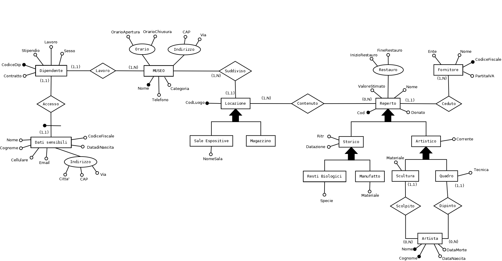

# Project Museum
This repository encompasses the report and code developed for the "Basi di Dati" (Database Systems) project as part of the Bachelor's Degree program at the University of Padua during the academic year [A.A. 2015/2016](https://en.didattica.unipd.it/off/2015/LT/SC/SC1167/000ZZ/SCP4065533/N0).

## Project Specification
The project must meet the following requirements:
1. Utilization of more than five tables;
2. Incorporation of at least one hierarchical dataset.;
3. Inclusion of all three types of relationships: one-to-one (1:1), one-to-many (1:N) or many-to-many (M:N);
4. Implementation of at least six relevant queries and/or procedures;
5. Integration of at least two functions;
6. Introduction of at least two triggers.

## Project idea and realization
Given Padua's rich history and cultural heritage, abundant with artifacts dating back to ancient times, a museum management system was simulated for this project.
The system managed a museum, its employees and artifacts. The architecture and relationships are visualized in the ER diagram:



## Project Structure
The project is organized as follows:
* the `img` directory contains ER diagrams in PNG format, along with the original [DIA](http://dia-installer.de/) file;
* the `sql` directory houses all SQL scripts, segmented into files arranged in logical groups;
* the `report.pdf` file represents the Italian project report submitted.

## Prerequisites
* [MySQL 5.5](https://www.mysql.com/)

## Usage
```shell
git clone https://github.com/Giglium/Project-Museum.git
cd Project-Museum/sql
mysql -u <username> -p
source createDatabase.sql; 
source function.sql; 
source procedure.sql; 
source query.sql; 
source triggers.sql; 
```
## Docker Usage
```shell
 docker run --rm -p 3306:3306 ghcr.io/giglium/project-museum:latest
```

## Authors
* [Francesco Antonio Migliorin](https://github.com/Giglium)
* [Davide Saonara](https://github.com/solosao)

## License
This project is licensed under the MIT License - see
the [LICENSE](https://github.com/Giglium/vinted_scraper/blob/main/LICENSE) file for details.
